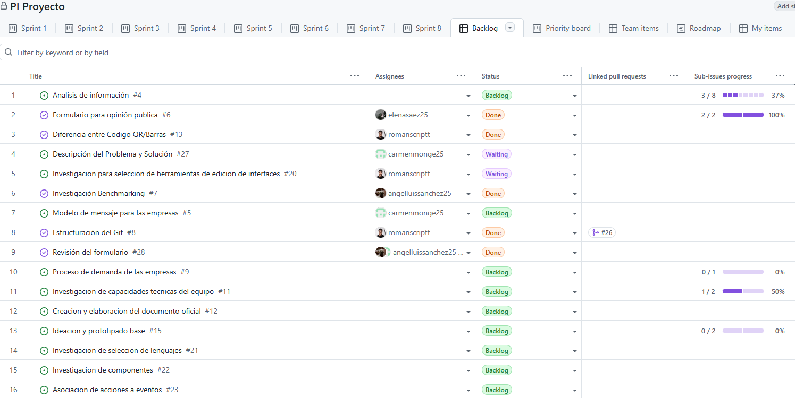
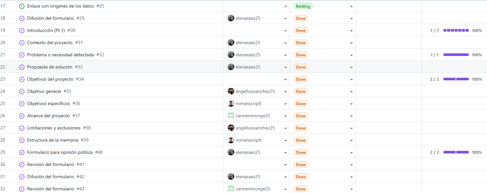
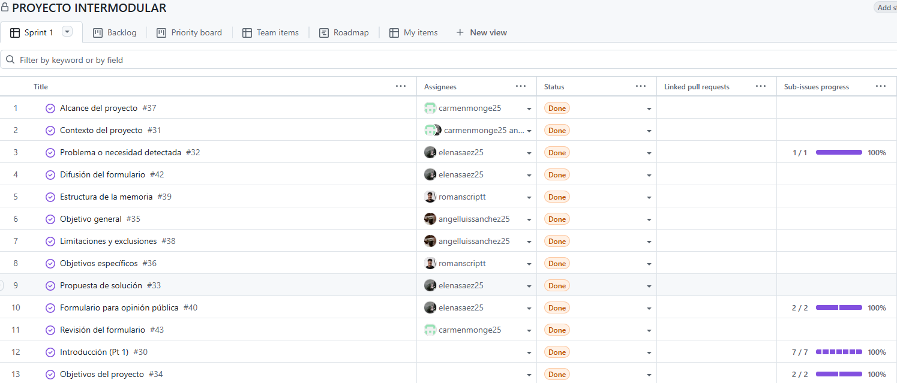
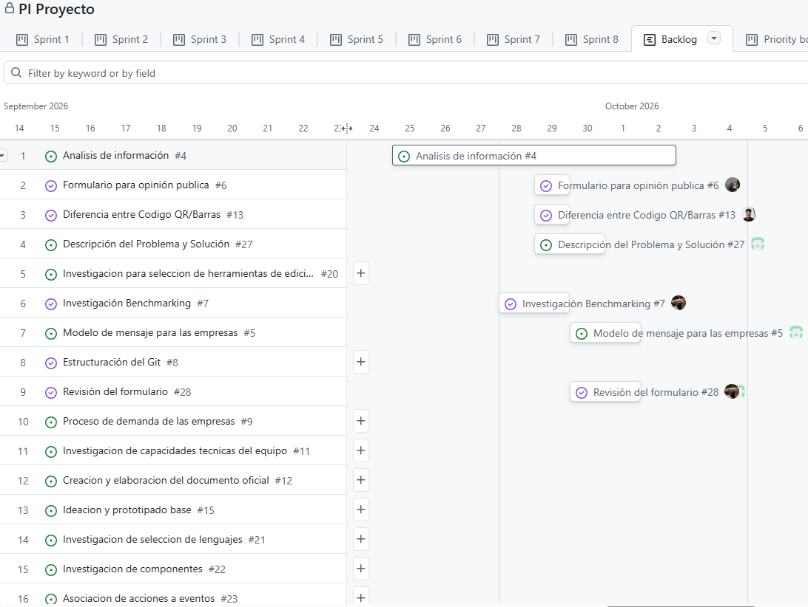
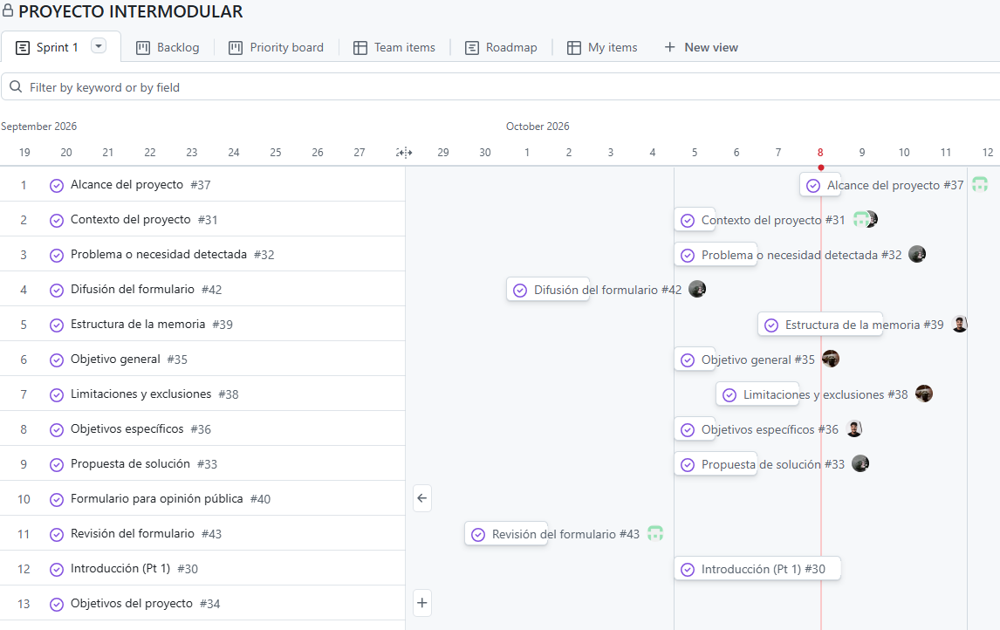

# Documentación del cambio de proyecto

## Tabla de contenidos:
1. [Introducción](#1-introducción)  
2. [Motivo de la creación de “PROYECTO INTERMODULAR”](#2-motivo-de-la-creación-de-proyecto-intermodular)  
3. [Comparación de los proyectos](#3-comparación-de-los-proyectos)  
    * [3.1. Estructuras](#31-estructuras)  
      * [3.1.1. Primer Proyecto](#311-primer-proyecto)  
      * [3.1.2. Proyecto Actual](#312-proyecto-actual)  
    * [3.2. Tablas](#32-tablas)  
      * [3.2.1. Primer Proyecto](#321-primer-proyecto)  
      * [3.2.2. Proyecto Actual](#312-proyecto-actual)  
    * [3.3. Cronogramas](#33-cronogramas)  
      * [3.3.1. Primer Proyecto](#331-primer-proyecto)  
      * [3.3.2. Proyecto Actual](#312-proyecto-actual)  
4. [Observaciones](#4-observaciones)  

## 1. Introducción

Durante el desarrollo del Proyecto Intermodular se utilizó inicialmente un proyecto Kanban denominado “PI Proyecto”, en el que el equipo comenzó a trabajar y a desarrollar diferentes tareas relacionadas con el proyecto.

Tras revisar la organización del Sprint 1 del proyecto y compararla con la estructura requerida, el equipo detectó que la primera planificación no se ajustaba completamente a los requisitos establecidos. En particular, la estructura de las tareas no seguía exactamente la organización solicitada y se habían incluido algunas tareas que finalmente no formaban parte de los requisitos del proyecto.

Por este motivo, se decidió crear un nuevo proyecto Kanban denominado “PROYECTO INTERMODULAR”, cuya organización del Sprint 1 sigue exactamente la estructura indicada para el desarrollo y documentación del proyecto.

Este cambio no supone el inicio del proyecto desde cero, sino una reorganización y continuación del trabajo realizado previamente para adaptarlo a los requisitos establecidos.

## 2. Motivo de la creación de “PROYECTO INTERMODULAR”

El proyecto “PI Proyecto” fue utilizado por el equipo durante la primera fase del desarrollo. En él se puede comprobar que los cuatro integrantes comenzaron a trabajar en el Sprint 1 y realizaron tareas relacionadas con su desarrollo.

Posteriormente, al revisar la planificación, se detectaron los siguientes problemas:

- La estructura del Sprint 1 no coincidía exactamente con la organización solicitada.
- Existían tareas que no eran necesarias para los requisitos establecidos.
- La organización inicial podía dificultar la posterior elaboración de la memoria del proyecto.
- Se consideró más adecuado crear una nueva estructura desde la que continuar el desarrollo de forma ordenada.

Por ello, el equipo decidió crear “PROYECTO INTERMODULAR”.

La finalidad de este nuevo proyecto fue disponer de un Sprint 1 con una estructura limpia y organizada que correspondiera exactamente con los apartados requeridos:

- 1\. INTRODUCCIÓN
- 1.1. Contexto del proyecto
- 1.2. Problema o necesidad detectada
- 1.3. Propuesta de solución
- 1.4. Objetivos del proyecto
- 1.4.1. Objetivo general
- 1.4.2. Objetivos específicos
- 1.5. Alcance del proyecto
- 1.6. Limitaciones y exclusiones
- 1.7. Estructura de la memoria
  
## 3. Comparación de los proyectos

### 3.1. Estructuras:

#### 3.1.1. **Primer Proyecto:**

   

 

#### 3.1.2. **Proyecto Actual:**

   

 

[Ir a Observaciones](#4-observaciones) 

### 3.2. Tablas:

#### 3.2.1. **Primer Proyecto:**

    
   

 

#### 3.2.2. **Proyecto Actual:**

   

 

[Ir a Observaciones](#4-observaciones) 

### 3.3. Cronogramas:

#### 3.3.1. **Primer Proyecto:**

    

 

#### 3.3.2. **Proyecto Actual:**

   

 

## 4. Observaciones:

Como podemos observar, la imagen de la [primera estructura](#311-primer-proyecto) presenta un proyecto Kanban sin terminar compuesto por 32 tareas que no cumplen con la estructura requerida. Mientras que en la [segunda estructura](#312-proyecto-actual), encontramos un proyecto Kanban acabado, con la estructura requerida, con tan solo 13 tareas.

Si comparamos las tablas de los proyectos, se muestra de forma clara como la [primera tabla](#321-primer-proyecto) muestra un gran número de tareas en diferentes fases de desarrollo. Sin embargo, en la [segunda tabla](#322-proyecto-actual) destaca el orden, limpieza y simplicidad de las tareas, que además se encuentran todas realizadas. Si observamos detenidamente, podremos localizar algunas tareas que han sido trasladadas del antiguo al actual proyecto, y otras que ya no aparecen.  

Por otro lado, al observar los cronogramas podemos distinguir como en el [primer cronograma](#331-primer-proyecto) el comienzo del proyecto se realiza el 24 de octubre de 2026, a diferencia del [cronograma actual](#332-proyecto-actual) que muestra como la primera tarea comienza el 29 de octubre del mismo año, esto se debe al cambio de proyecto. El actual, se creó el lunes 4 de septiembre, por ello la mayor concentración de tareas se encuentra en dicha fecha. La razón por la que hay tareas que aparecen antes de haber creado el proyecto es debido a que dichas tareas han sido trasladas tal cual al actual, por ende se ha decidido mantener la fecha en la que se realizaron realmente. Sin embargo, tareas que estaban en el antiguo y se pasaron al oficial, han sido mejorados, por dicha razón aparecen tantos seguidos el 4 de septiembre.

