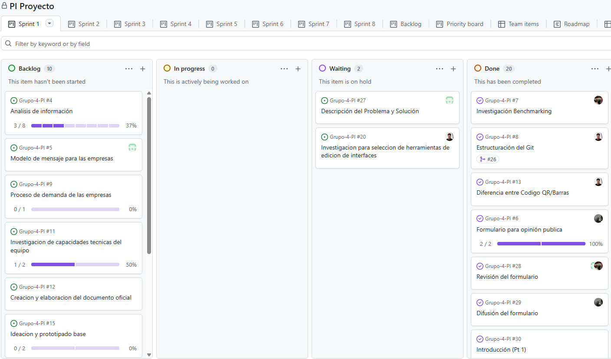
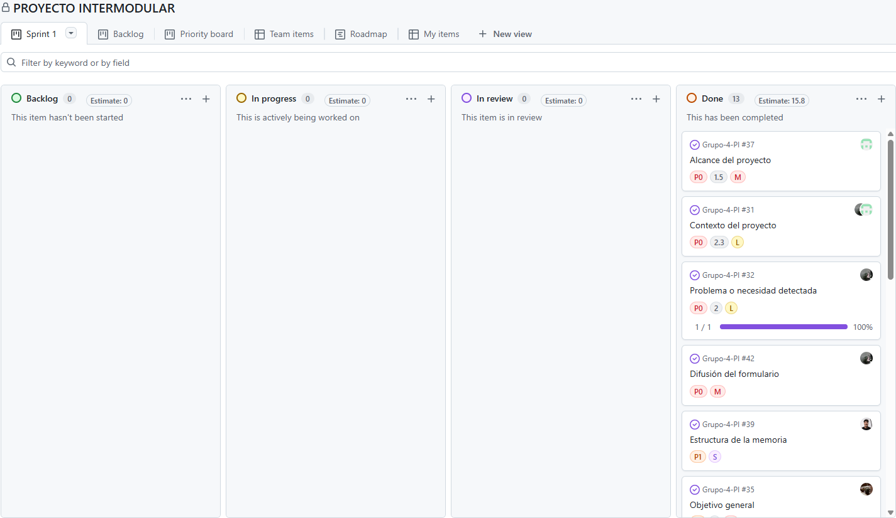

# Documentación del cambio de proyecto

## 1. Introducción

Durante el desarrollo del Proyecto Intermodular se utilizó inicialmente un proyecto Kanban denominado “PI Proyecto”, en el que el equipo comenzó a trabajar y a desarrollar diferentes tareas relacionadas con el proyecto.

Tras revisar la organización del Sprint 1 del proyecto y compararla con la estructura requerida, el equipo detectó que la primera planificación no se ajustaba completamente a los requisitos establecidos. En particular, la estructura de las tareas no seguía exactamente la organización solicitada y se habían incluido algunas tareas que finalmente no formaban parte de los requisitos del proyecto.

Por este motivo, se decidió crear un nuevo proyecto Kanban denominado “PROYECTO INTERMODULAR”, cuya organización del Sprint 1 sigue exactamente la estructura indicada para el desarrollo y documentación del proyecto.

Este cambio no supone el inicio del proyecto desde cero, sino una reorganización y continuación del trabajo realizado previamente para adaptarlo a los requisitos establecidos.

## 2. Motivo de la creación de “PROYECTO INTERMODULAR”

El proyecto “PI Proyecto” fue utilizado por el equipo durante la primera fase del desarrollo. En él se puede comprobar que los cuatro integrantes comenzaron a trabajar en el Sprint 1 y realizaron tareas relacionadas con su desarrollo.

Posteriormente, al revisar la planificación, se detectaron los siguientes problemas:

- La estructura del Sprint 1 no coincidía exactamente con la organización solicitada.
- Existían tareas que no eran necesarias para los requisitos establecidos.
- La organización inicial podía dificultar la posterior elaboración de la memoria del proyecto.
- Se consideró más adecuado crear una nueva estructura desde la que continuar el desarrollo de forma ordenada.

Por ello, el equipo decidió crear “PROYECTO INTERMODULAR”.

La finalidad de este nuevo proyecto fue disponer de un Sprint 1 con una estructura limpia y organizada que correspondiera exactamente con los apartados requeridos:

- 1\. INTRODUCCIÓN
- 1.1. Contexto del proyecto
- 1.2. Problema o necesidad detectada
- 1.3. Propuesta de solución
- 1.4. Objetivos del proyecto
- 1.4.1. Objetivo general
- 1.4.2. Objetivos específicos
- 1.5. Alcance del proyecto
- 1.6. Limitaciones y exclusiones
- 1.7. Estructura de la memoria
  
## 3. Comparación estructuras

### 3.1. **Estructura Primer Proyecto:**

   

 

### 3.2. **Estructura Proyecto Actual:**

   

 

### 3.3. Observaciones:

Como podemos observar, la [primera imagen](#31-estructura-primer-proyecto) presenta un proyecto Kanban sin terminar compuesto por 32 tareas que no cumplen con la estructura requerida. Mientras que en la [segunda foto](#32-estructura-proyecto-actual), encontramos un proyecto Kanban acabado, con la estructura requerida, con tan solo 13 tareas.

